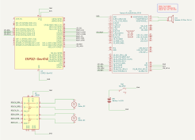

# El Poisson Billy

El Poisson is yet another hacked Big Mouth Billy Bass. It was a little contribution to Moorea's 2023
music video "[Un effort](https://www.youtube.com/watch?v=xZalNH8_v24)". This particular hack
features a Bluetooth audio sink and motor control via bluetooth. The python GUI is easy to use and
can even connect to Ableton via a virtual MIDI interface, so that the fish's movements can be
programmed as a MIDI track.

## Features

- ESP32 configured as bluetooth audio sink with additional serial port profile (SPP) for control.
- Teensy Audio Shield Rev D for high-quality audio output.
- H-bridge L293D for efficient motor control.
- Python GUI for easy interaction with the device.

## Hardware


### Components

- Billy the Bass
- ESP32-DevKitC (https://www.espressif.com/en/products/devkits/esp32-devkitc/overview)
- Teensy Audio Shield Rev D (https://www.pjrc.com/store/teensy3_audio.html)
- H-bridge L293D (https://www.st.com/en/motor-drivers/l293d.html)

### Schematic

[](https://raw.githubusercontent.com/hgrf/el-poisson-billy/main/hw/el_poisson_billy_rev1.svg)

## Software

### Python GUI


You can set up the python app with:

```sh
python3 -m venv venv
. venv/bin/activate
python -m pip install --upgrade pip
pip install -r requirements.txt

python -m gui
```

### Firmware

The firmware is based on the following examples from ESP-IDF:

- https://github.com/espressif/esp-idf/tree/v5.1.1/examples/bluetooth/bluedroid/classic_bt/a2dp_sink
- https://github.com/espressif/esp-idf/blob/v5.1.1/examples/bluetooth/bluedroid/classic_bt/bt_spp_acceptor

Please use ESP-IDF v5.1.1 to build the firmware.

To flash a binary release, use (for example):

```sh
pip install esptool==4.6.2
esptool.py write_flash 0x10000 el-poisson-billy-0.1.0.bin
```

## References

### Other Billy Bass projects

- https://maker.pro/arduino/projects/how-to-animate-billy-bass-with-bluetooth-audio-source
- https://www.instructables.com/Animate-a-Billy-Bass-Mouth-With-Any-Audio-Source/
- https://www.hackster.io/news/this-mod-turns-big-mouth-billy-bass-into-an-arduino-controlled-platform-for-shenanigans-cac985a04b47
- https://os.mbed.com/cookbook/Big-Mouth-Billy-Bass
- https://gist.github.com/jamesbulpin/f3b20833ab0bf035ae8fd3a69405b222
- https://github.com/TensorFlux/BTBillyBass

### Mouth synchronization

- https://mittalparveen652.medium.com/face-eye-and-mouth-detection-with-python-458f2a028674
- https://hackprojects.wordpress.com/tutorials/opencv-python-tutorials/opencv-mouth-detection-using-haar-cascades/
- https://github.com/mauckc/mouth-open
- https://github.com/opencv/opencv/tree/master/data/haarcascades
- https://github.com/peterbraden/node-opencv/blob/master/data/haarcascade_mcs_mouth.xml
- https://github.com/DanielSWolf/rhubarb-lip-sync

### Others

- PyQt and OpenCV: https://gist.github.com/docPhil99/ca4da12c9d6f29b9cea137b617c7b8b1

### KiCad symbols and footprints

- ESP32-DevKitC: https://github.com/espressif/kicad-libraries
- Teensy Audio Shield Rev D: https://forum.pjrc.com/threads/65435

